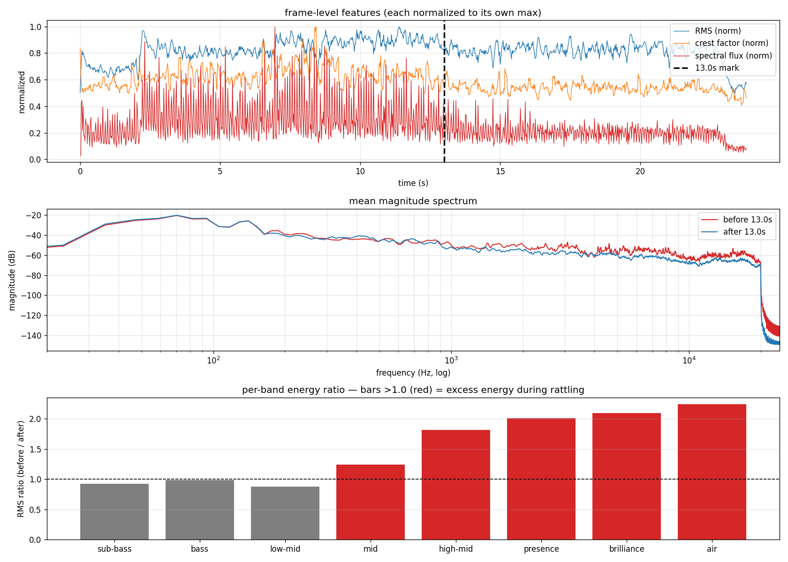
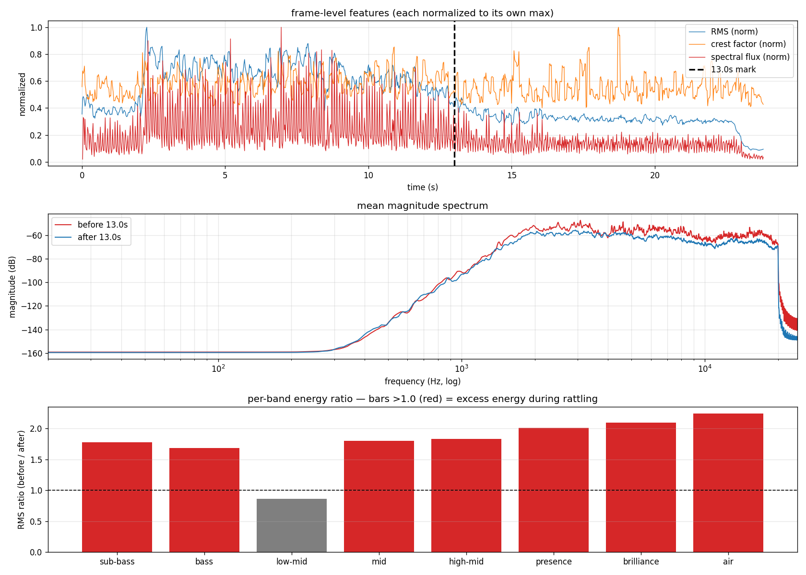

# engine-sound-splitter

Splits a motorcycle engine recording into combustion-drone (low band)
and mechanical-rattle (high band) stems via complementary Butterworth
crossover. Pure split — `engine.wav + rattles.wav == input` bit-exact.

```bash
uv run python main.py separate                        # default crossover 1800 Hz
uv run python main.py analyze                         # before/after-mark stats + plot
uv run python main.py spectrogram                     # log-freq dB spectrogram
uv run python main.py separate --crossover 1500       # tune
uv run python main.py analyze rattles.wav -o foo.png  # any input, any output
```

## Spectrogram


## Analysis

Frame features and per-octave-band energy contrast across the 13s mark
on the source recording — quantifies what "rattling" looks like
statistically (spectral flux +57%, energy doubles above 2 kHz).



Same analysis run on `rattles.wav` validates the split — rattle energy
is 2× louder before 13s (vs. ~25% with HPSS, ~2.4× with spectral
subtraction), with no engine-band content leaking through.



## Audio

- [engine.mp3](engine.mp3)
- [rattles.mp3](rattles.mp3)

> mp3s in this directory were encoded from earlier separator outputs
> (spectral subtraction). Re-encode from the current `engine.wav` /
> `rattles.wav` if you want to hear the crossover version.
